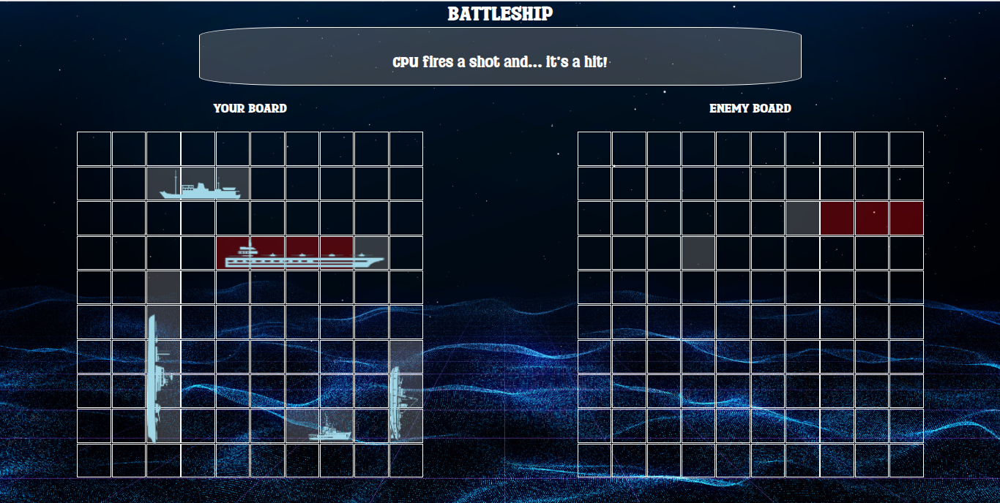

# 🎨 Etch-a-Sketch

A fun browser-based Etch-a-Sketch clone made with vanilla JavaScript. Draw by hovering over a grid, choose your own colors, adjust the size of the grid, and reset the board with a single click!

## 🚀 Features

- 🖌️ Hover to draw on a grid-based canvas
- 🎨 Choose color or enable rainbow mode
- 🔁 Reset and resize the grid dynamically
- ⚙️ Fully functional without any libraries or frameworks
- 📱 Responsive layout for different screen sizes

## 🖼️ Screenshot

 <!-- Make sure to add this image to your repo -->

## 🛠️ Built With

- HTML5
- CSS3
- JavaScript (ES6+)
